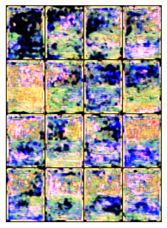
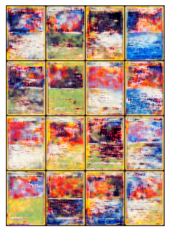
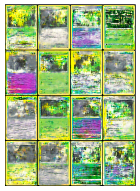

# PkmnGAN
PkmnGAN is a Python program which trains a GAN to generate Pokemon cards.

# Usage
Requires PyTorch and the card dataset (to be added). Alternatively generate the dataset yourself using files.py and verify.py. Then simply run the Jupyter Notebook pkmngan.ipynb.

# Example outputs of first 10 epochs

